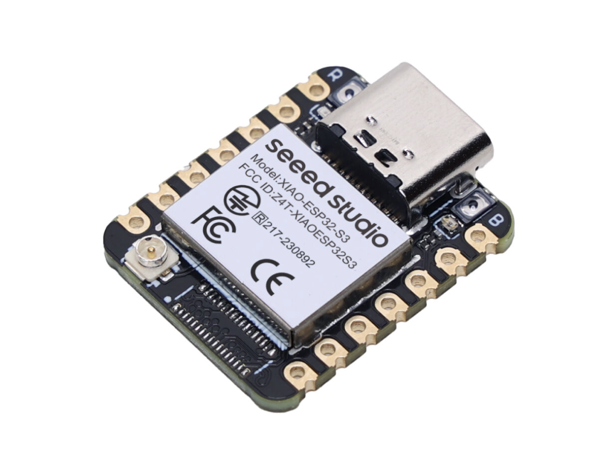
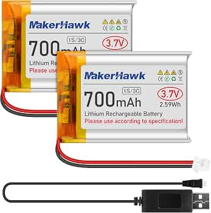
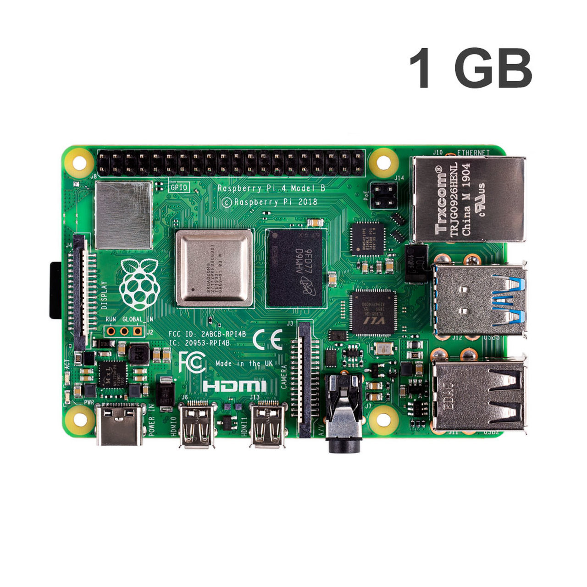
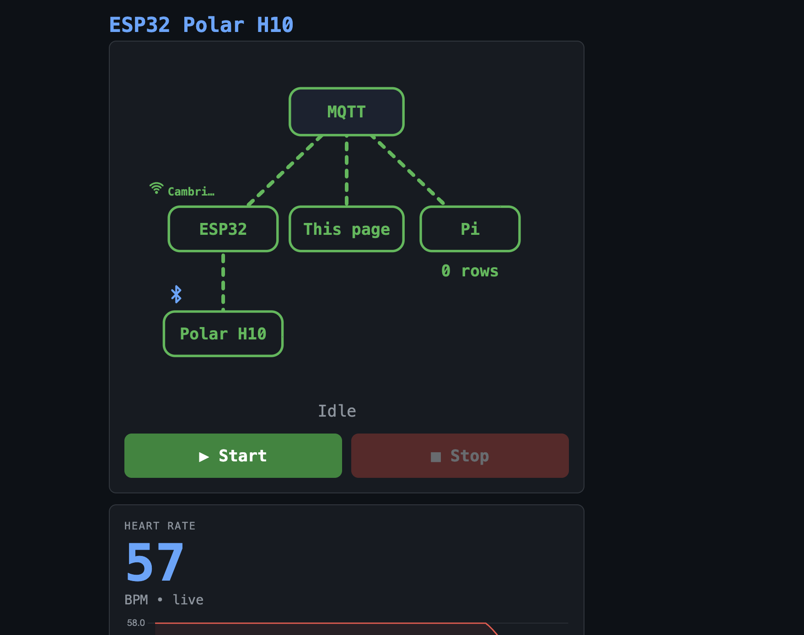

# ESP32 Polar H10 HR Receiver

Real-time heart rate logging from a Polar H10 worn on the field, relayed through an ESP32 to a Raspberry Pi at home **over the internet via HiveMQ Cloud (MQTT)**. Built for football practice — eventual goal is to pair HR data with accelerometer data to get recovery and exertion insights.

```
                                                          ┌─► Raspberry Pi ──► SQLite (hr_data.db)
Polar H10 ──BLE──► ESP32 (on body) ──MQTT/TLS──► HiveMQ ──┤   (at home, subscribes)
             HR + ACC              publish        Cloud   └─► Control page (GitHub Pages)
             notifications         polar/hr,              subscribe/publish over WebSocket:
                                   polar/acc              live status + Start/Stop session
```

Because both the ESP32 and the Pi connect **out** to HiveMQ Cloud, they no longer need to be on the same WiFi. The ESP32 can be on a phone hotspot at practice while the Pi sits at home — no port forwarding, no same-network requirement.

---

## Hardware

| Part | Details | Link |
|---|---|---|
| **ESP32** | Seeed Studio XIAO ESP32-S3 | [Buy](https://www.seeedstudio.com/XIAO-ESP32S3-p-5627.html?srsltid=AfmBOoo0wlJ74bYS3x7DpeEOxG-mdwpJrmbztCb-g2nyqYOBE72SCn6N) |
| **Heart rate sensor** | Polar H10 | |
| **Battery** | LiPo battery | [Buy](https://www.amazon.com/dp/B0FZSYM9T2?ref=ppx_yo2ov_dt_b_fed_asin_title&th=1) |
| **Server** | Raspberry Pi 1GB | |
| **Broker** | HiveMQ Cloud (free tier) | [console](https://console.hivemq.cloud) |

<p>




</p>

---

## Project Structure

```
esp32/                      — PlatformIO project (flashed to the ESP32)
  src/
    main.cpp
    config.h                — WiFi + HiveMQ credentials (gitignored, edit this)
Raspberrypi/
  hr_receiver/              — Python MQTT subscriber that runs on the Pi
    hr_receiver.py
    install.sh              — one-time setup script
    requirements.txt        — paho-mqtt
    hr_receiver.service     — systemd unit (auto-start on boot)
    mqtt.env.example        — template for the Pi's credentials (copy to mqtt.env)
  dashboard/                — Flask web dashboard the Pi hosts (reads hr_data.db)
    app.py                  — server + JSON API
    templates/index.html    — live dashboard page (charts, LIVE/OFFLINE status)
    install.sh              — one-time setup (venv + Flask + systemd)
    dashboard.service       — systemd unit (auto-start on boot)
web/
  control.html              — static control page (served from GitHub Pages; talks to
                              the broker over MQTT-over-WebSocket, drives start/stop)
data/
  hr_data.db                — SQLite database (copied from Pi)
  analyze.py                — analysis script
deploy-pi.sh                — push receiver code changes from Mac + restart (same network)
deploy-dashboard.sh         — push dashboard code changes from Mac + restart (same network)
pi-server.sh                — start/stop/status the Pi services from Mac (same network)
```

---

## Setup

### Step 1 — Get HiveMQ Cloud credentials

In the [HiveMQ Cloud console](https://console.hivemq.cloud), open your cluster and note four things:

- **Host** — e.g. `xxxxx.s1.eu.hivemq.cloud` (the "MQTT URL", no `https://`)
- **Port** — `8883` (TLS)
- **Username** / **Password** — create one under **Access Management → Credentials** with **Publish and Subscribe** permission

### Step 2 — Configure the ESP32

Edit `esp32/src/config.h` (gitignored):

```c
// WiFi — personal network tried first, eduroam as fallback
#define HOME_SSID   "your wifi name"
#define HOME_PASS   "your wifi password"

// HiveMQ Cloud
#define MQTT_HOST   "xxxxx.s1.eu.hivemq.cloud"
#define MQTT_PORT   8883
#define MQTT_USER   "your_username"
#define MQTT_PASS   "your_password"
#define MQTT_TOPIC  "polar/hr"
```

### Step 3 — Flash the ESP32

```bash
cd esp32
pio run --target upload
```

### Step 4 — Set up the Raspberry Pi receiver

Copy the code to the Pi (from your Mac, on the same network):

```bash
./deploy-pi.sh
```

Then SSH in and run the one-time installer:

```bash
ssh carter@pi4server.local
cd ~/projects/python/esp-polar/hr_receiver
./install.sh          # creates the venv, installs paho-mqtt, sets up mqtt.env + systemd service
nano mqtt.env         # fill in the SAME 4 HiveMQ values as config.h, then save
sudo systemctl restart hr_receiver
```

> `mqtt.env` holds your credentials and is **gitignored** — it lives only on the Pi and is never overwritten by `deploy-pi.sh`.

---

## Running & Controlling the Pi Service

The receiver runs as a systemd service (`hr_receiver`) and auto-starts on boot. Three ways to control it depending on where you are:

### On your Mac, same network — `pi-server.sh`

```bash
./pi-server.sh start      # start the receiver
./pi-server.sh stop       # stop it
./pi-server.sh restart    # restart it
./pi-server.sh status     # is it running?
./pi-server.sh logs       # follow live logs (Ctrl-C to exit)
```

Run these from the project root. If you're **not on the same WiFi as the Pi**, it prints a clear "can't reach the Pi — you must be on the same network" message.

### From anywhere (field, phone) — Raspberry Pi Connect

1. Open **[connect.raspberrypi.com](https://connect.raspberrypi.com)** → your Pi (**pi4server**) → **Remote Shell**
2. Type any of these shortcuts (they work from any directory):

| Command | Does |
|---|---|
| `hr-start` | start the receiver |
| `hr-stop` | stop it |
| `hr-restart` | restart it |
| `hr-status` | is it running? |
| `hr-logs` | follow live data (Ctrl-C to exit) |

This tunnels through your home router, so it works over the internet — no same-network requirement.

### Directly on the Pi (raw systemctl)

```bash
sudo systemctl start|stop|restart|status hr_receiver
sudo journalctl -u hr_receiver -f
```

---

## Deploying Code Changes to the Pi

After editing anything in `Raspberrypi/hr_receiver/`, push it from your Mac (same network):

```bash
./deploy-pi.sh
```

This rsyncs the folder to `/home/carter/projects/python/esp-polar/hr_receiver`, reinstalls Python deps, and restarts the service. It **never** overwrites the Pi's `.venv`, `hr_data.db`, or `mqtt.env`.

> If you edit `hr_receiver.service` itself, re-register the systemd unit once on the Pi (re-run `./install.sh` or the `sed | sudo tee` step) — `deploy-pi.sh` copies files and restarts, but doesn't reinstall the unit.

---

## On the ESP32

Power it on. It will:
1. Connect to WiFi (tries home network first, falls back to eduroam)
2. Connect to HiveMQ Cloud over TLS (port 8883)
3. Scan for the Polar H10 over BLE
4. Publish HR data to the `polar/hr` topic in batches every 30 seconds

### Status Indicators (backlight)

| Backlight | Meaning |
|---|---|
| On solid | Booting |
| Slow blink | Connecting to WiFi |
| Quick blinks → on | WiFi connected |
| Slow blink | Scanning for Polar H10 |
| Off | Connected to Polar, recording |

### Control Page (GitHub Pages)

The ESP32 no longer hosts its own web server or WiFi access point — that was too much load alongside BLE + WiFi + MQTT. Instead, a lightweight static page (`web/control.html`, served from **GitHub Pages**) talks straight to the same HiveMQ Cloud broker over MQTT-over-WebSocket. It subscribes to the ESP's status topic and can start/stop a recording session — no same-network requirement, and the ESP just publishes.



What it shows:
- a **live connection tree** (MQTT ↔ ESP32 / This page / Pi, and Polar H10 ↔ ESP32) where each link turns green and animates when it's carrying data — the dots on the Polar → ESP32 → MQTT legs flow **upward** toward the broker, tracing the HR data path;
- the **WiFi network** the ESP joined (green WiFi icon + SSID) above the ESP32 node, and a **Bluetooth glyph** by the Polar leaf while the strap is connected;
- **Start / Stop** session controls, and live **heart-rate** + **accelerometer** charts once a session is running.

The page is published straight from the repo — edit `web/control.html`, push, and GitHub Pages redeploys.

### Verify without the Pi

In the HiveMQ console there's a built-in **Web Client** — log in with your credentials, subscribe to `polar/hr`, and you'll see the heart-rate JSON arrive every ~30s. Confirms the ESP32→cloud half independently of the Pi.

---

## Web Dashboard (view data in a browser)

Instead of copying the DB to your Mac and running scripts, the Pi can host a **live web dashboard** that reads the same `hr_data.db` and shows it in a browser — open it from your phone or laptop on the same network:

```
http://pi4server.local:8000
```

It shows:
- a **LIVE / PAUSED / OFFLINE** banner (so you can tell at a glance if the feed is working) with current BPM and last-reading time,
- summary cards — total readings, acc samples, session duration, min/avg/max BPM,
- a **heart-rate chart** and an **accelerometer (X/Y/Z) chart**,
- time-range buttons (5 min / 30 min / All) and auto-refresh every 3s.

The dashboard is **read-only** — it never writes to or locks the database, so it runs safely alongside `hr_receiver`.

### One-time setup on the Pi

```bash
./deploy-dashboard.sh                      # from your Mac (same network) — copies the code to the Pi
ssh carter@pi4server.local
cd ~/projects/python/esp-polar/dashboard
./install.sh                               # creates venv, installs Flask, offers to auto-start on boot (say y)
```

### Control it (same pattern as the receiver)

```bash
./pi-server.sh status dashboard            # is it running?
./pi-server.sh restart dashboard
./deploy-dashboard.sh                      # push code changes + restart
```

Directly on the Pi: `sudo systemctl status dashboard` · `sudo journalctl -u dashboard -f`.

> The dashboard reads `../hr_receiver/hr_data.db` by default (it's deployed as a sibling folder). Override with the `HR_DB` env var in `dashboard.service` if your layout differs, or change `PORT` (default 8000).

---

## Data

HR readings are saved to `hr_data.db` (SQLite) on the Pi with:
- `received` — timestamp
- `t_ms` — millis since ESP32 boot
- `bpm` — heart rate
- `rr_ms` — RR intervals (JSON array, ms)

### Copy data from the Pi to your Mac

```bash
scp carter@pi4server.local:~/projects/python/esp-polar/hr_receiver/hr_data.db data/
```

### Analyze

```bash
cd data
source ../.venv/bin/activate
python analyze.py
```

Prints key metrics (avg/min/max BPM, RR intervals, duration) and shows a BPM-over-time graph.

---

## Security Notes

- `config.h` and `mqtt.env` hold credentials and are **gitignored**.
- The ESP32 uses TLS but currently skips server-certificate validation (`setInsecure()` in `main.cpp`) — encrypted, but not pinned to HiveMQ's CA. Fine for a hobby setup; can be hardened by embedding the HiveMQ root CA.
